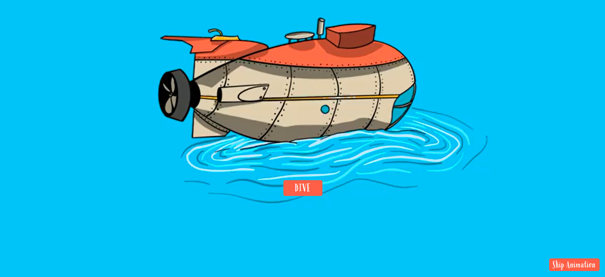

<h1 align="center">Bottom Dwellers</h1>

  Welcome to the official repository for <strong>Bottom Dwellers</strong>!

Dive into the whimsical world of Poseidon's sons as they navigate their unique lives at the bottom of the ocean.

  

<h2 align="center">What Are Bottom Dwellers?</h2>

  <strong>Bottom Dwellers</strong> is an NFT collection built on Radix that humorously explores mythical family dynamics and the struggle for identity and purpose in a modern context.

  These degenerate sons reflect Poseidon's adventurous love life, often finding themselves ensnared by rather unconventional partners lurking at the bottom of the deep.

  Despite their carefree attitudes and longing to impress Poseidon, they know they will never live up to his expectations.

  The collection hilariously explores mythical family dynamics and the struggle for identity and purpose in a modern context.

 
 
 

## Contact

For more information, feel free to reach out:

- **Telegram:** [Join our Telegram](https://bottomdwellers.xyz/telegram.html)
- **Twitter:** [Follow us on Twitter](https://twitter.com/bottom_dwellers)

## Contributors

- **Schwan.xrd** - [Twitter](https://github.com/A-R96)
- **Isaac.xrd** - [Twitter](https://twitter.com/isaac_XRD)
- **GREEZELOUISE.xrd** - [Twitter](https://twitter.com/GREEZELOUISE)
---

Thank you for visiting the Bottom Dwellers website repository. Stay tuned for more updates!
